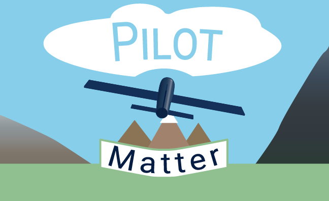

# Pilot Matter 

`Ctrl + click` to [play](https://isocialpractice.github.io/pilot-matter/index.html)

A browser-based 3D flight simulator built with [Three.js](https://threejs.org/). Fly over a procedurally generated landscape with mountains, plains, beaches, and snow-capped peaks — all rendered in real time with no build step required.



## Features

- **Arcade flight model** — throttle up, pitch, roll, and bank through coordinated turns
- **Procedural terrain** — multi-octave fractal Brownian motion (fBm) noise generates a unique landscape every time
- **Random mountains** — a dedicated algorithm scatters mountains across ~10% of the terrain surface using smooth radial bumps
- **Height-based vertex colouring** — water, sand, grass, rock, and snow rendered purely through vertex colours, no textures needed
- **Atmospheric fog** — exponential fog fades the world to sky blue in the distance, hiding terrain edges and giving the illusion of an infinite world
- **Three camera modes** — chase, cockpit, and orbit views, cycled with the `C` key
- **HUD** — live readout of airspeed (knots), altitude (ft), throttle (%), and camera mode
- **Zero build step** — runs directly in the browser via ES modules and an import map

## Getting Started

### Prerequisites

A modern browser with ES module support (Chrome, Firefox, Edge, Safari). No Node.js, no bundler, no install needed — Three.js is loaded from a CDN.

### Running locally

Because ES modules require a server context, open the project with any static file server. The simplest options:

```bash
# Python
python -m http.server 8080

# Node (npx, no install)
npx serve .

# VS Code
# Install the "Live Server" extension and click "Go Live"
```

Then open `http://localhost:8080` in your browser.

## Controls

| Key | Action |
|-----|--------|
| `W` / `↑` | Pitch up (nose up) |
| `S` / `↓` | Pitch down (nose down) |
| `A` / `←` | Roll left |
| `D` / `→` | Roll right |
| `Q` | Yaw left |
| `E` | Yaw right |
| `Shift` | Throttle up |
| `Ctrl` | Throttle down |
| `C` | Cycle camera (chase, cockpit, orbit) |
| `R` | Reset aircraft to starting position |

**Tip:** The aircraft is always subject to gravity. Apply throttle and pitch up gently to climb and maintain altitude.

## Project Structure

```
pilot-matter/
├── index.html          # Entry point — HUD markup, import map, styles
├── js/
│   ├── main.js         # Scene setup, render loop
│   ├── aircraft.js     # Arcade flight physics and 3D model
│   ├── input-map.js    # Pure keyboard-to-input-state mapping
│   ├── terrain.js      # Procedural fBm terrain with vertex colours
│   ├── mountains.js    # Random mountain placement algorithm (~10% coverage)
│   ├── camera.js       # Chase, cockpit, and orbit cameras
│   ├── sky.js          # Lighting and atmospheric fog
│   └── hud.js          # On-screen instrument display
└── test/               # Zero-dependency node:test unit tests
```

## Testing

Unit tests cover the pure logic (unit conversions, input mapping, mountain
count formula) and run on Node 18+ with no dependencies to install:

```bash
npm test        # or: node --test
```

## How the Terrain Works

The terrain is a `16000 × 16000` unit `PlaneGeometry` (200 × 200 segments) whose vertices are displaced vertically by a **fractal Brownian motion** function — seven octaves of smooth value noise layered together. Low-frequency octaves define broad valleys and mountain ranges; high-frequency octaves add fine surface detail.

A remapping curve flattens values below a threshold into wide plains and water, then exaggerates values above the threshold into steep peaks.

### Mountains

`mountains.js` runs a second pass after the base terrain is built. It calculates how many mountains are needed for ~10% area coverage:

```
count = (terrainArea × 0.10) / (π × avgRadius²)  ≈  14–15 mountains
```

Each mountain is a **smoothstep radial bump** added on top of the base terrain height. Vertex colours and the collision height cache are updated in the same pass, so the aircraft correctly collides with mountain peaks.

## Tech Stack

| Library | Version | Purpose |
|---------|---------|---------|
| [Three.js](https://threejs.org/) | 0.160.0 | 3D rendering |

No frameworks, no bundler, no dependencies beyond Three.js.

## License

MIT
